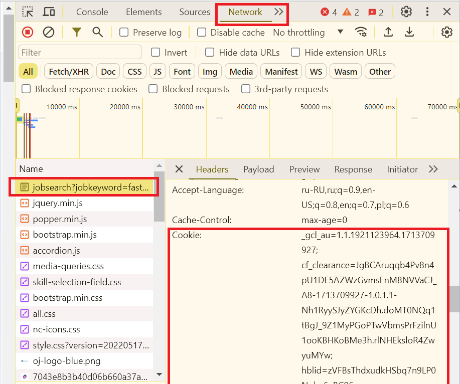

# OnlineJobs scraper

This application downloads job information (Title, Link, Description) by the specified title
in `result_files` dir

## Settings

Before starting the project, the following settings must be set:

1) Install **Python 3.11**  `https://www.python.org/`

2) Get Сookie for scraper jobs:
   - open job site
   - open the Developer Panel (Fn + F12)
   - open Network panel and select the first line from the Name list
   - click on Headers and copy the Сookie value.
   - add Cookie to **.env** file in `COOKIE` param *!COOKIE should be changed once a month*
   
   
   

## Start

- Run script `Run_scraper.bat` *!If this is the first run, it will take about a minute to install the necessary libraries*
- Write job title for search, select type for save informaion `(Json | Excel)`
- Click to `Search` button
- Check result files in dir `result_files`

   